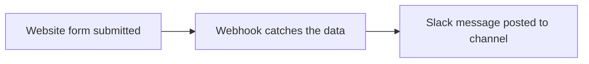
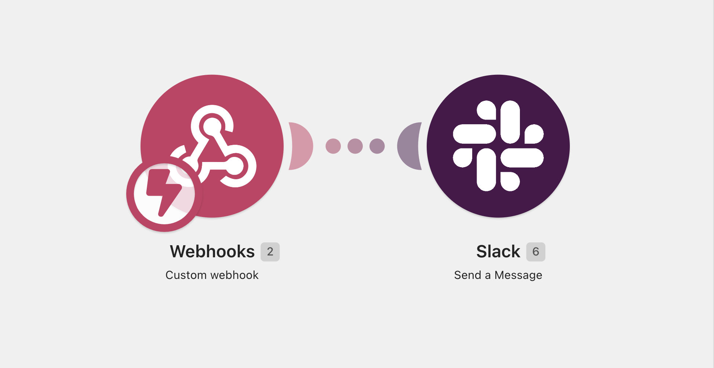
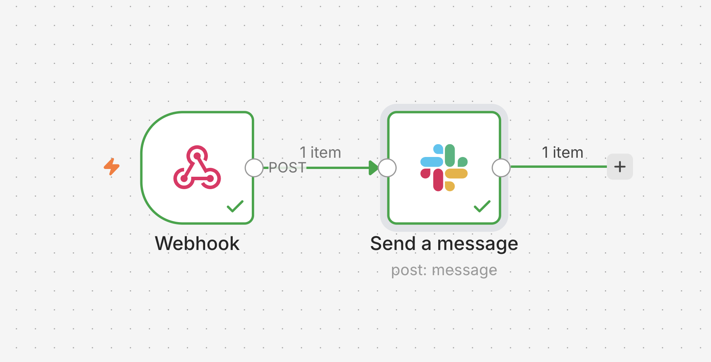

# Website Form → Slack Notification

Automatically posts a Slack notification the moment someone submits a website contact form. Built **two ways**, in [Make.com](https://make.com) and in [n8n](https://n8n.io), so it drops into whichever platform a client already uses.

## See it in action
Live 30-second demo (Make.com version): https://www.loom.com/share/fcc3673bd14d45b2947fd282bd88f069

## What it does
When a visitor submits the contact form, their **name, email, and message** are posted straight to a chosen Slack channel in real time.

## How it works


## Built with Make.com


A Custom Webhook trigger receives the form data and a Slack "Create a Message" action posts it to the channel.

## Built with n8n


The same flow in n8n: a Webhook node receives the submission, a Slack node posts the message. The full workflow is in `n8n-workflow.json` — import it into any n8n instance to run it yourself.

## What the Slack message looks like
```
🔔 New form submission!

👤 Name: Jane Doe
📧 Email: jane@company.com
💬 Message: I'd like to book a call
```

## Stack
- **Make.com** and **n8n** for the automation
- **Slack** for notifications
- Works with any web form: Typeform, Webflow, WordPress/Elementor, or custom HTML

## Files
- `form.html` — sample contact form that posts to a webhook
- `Scenario.png` — the Make.com scenario
- `n8n-workflow.png` — the n8n workflow
- `n8n-workflow.json` — importable n8n workflow

Built by Yahya. Available for automation work.
